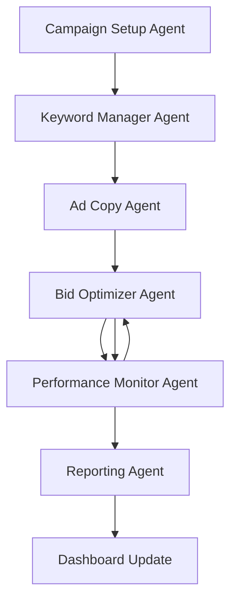

# Google Ads AI Agent Automation System

## 🏢 Client: 2015 Security Services Ltd
**Location:** London, UK  
**Website:** https://2015security.co.uk  
**Budget:** £600/month (£20/day)  
**Goal:** Increase qualified leads, improve ROI, reduce cost-per-lead (CPL)

---

## 🤖 AI Agent Architecture

This system implements a multi-agent AI workflow for automated Google Ads campaign management, specifically designed for 2015 Security Services Ltd's London-based security business.

### 📋 Agent Roles & Responsibilities

#### 1. **Campaign Setup Agent**
- **Purpose:** Initializes campaigns, sets budget, targeting
- **Key Functions:**
  - Creates new Google Ads campaigns (Search, Display, Performance Max)
  - Configures targeting for London-based businesses and homeowners
  - Sets up budget allocation and bid strategies
  - Validates campaign settings and compliance

#### 2. **Keyword Manager Agent**
- **Purpose:** Discovers new keywords, manages negative keywords
- **Key Functions:**
  - Expands keyword lists using AI and industry knowledge
  - Analyzes keyword performance and filters low-quality terms
  - Manages negative keyword lists to reduce wasted spend
  - Organizes keywords by match type (exact, phrase, broad)

#### 3. **Ad Copy Agent**
- **Purpose:** Generates ad variations using generative AI
- **Key Functions:**
  - Creates multiple ad copy variations using AI (Claude/GPT-4)
  - Validates ad copy compliance with Google Ads policies
  - Sets up A/B test groups for performance comparison
  - Focuses on trust, SIA licensing, and local London presence

#### 4. **Bid Optimizer Agent**
- **Purpose:** Adjusts bids in real-time based on conversion probability
- **Key Functions:**
  - Analyzes performance metrics (CPA, CTR, ROAS, Quality Score)
  - Applies optimization rules based on KPI thresholds
  - Makes automated bid adjustments within safe limits
  - Records bid history for performance analysis

#### 5. **Performance Monitor Agent**
- **Purpose:** Pauses low-performing ads, reallocates budget
- **Key Functions:**
  - Monitors campaign performance in real-time
  - Generates alerts for critical performance issues
  - Executes automated actions (pause campaigns, adjust bids)
  - Tracks performance trends and generates insights

#### 6. **Reporting Agent**
- **Purpose:** Generates performance dashboards & insights
- **Key Functions:**
  - Creates comprehensive performance reports
  - Updates real-time dashboard with KPIs
  - Generates actionable insights and recommendations
  - Exports data in multiple formats (JSON, CSV)

---

## 🔄 Workflow Process

### Stage 1: Setup → Optimization → Monitoring → Reporting



### 📊 Data Flow & Agent Communication

1. **Input Data:**
   - Budget: £600/month
   - Target audience: London businesses & homeowners
   - Services: Security guards, construction security, residential security
   - Geographic targeting: London + 25-mile radius

2. **Agent-to-Agent Communication:**
   - Campaign Setup → Keywords & Ad Copy
   - Performance Monitor → Bid Optimizer
   - All Agents → Reporting Agent
   - Reporting Agent → Dashboard

3. **Output Data:**
   - Optimized campaigns with targeted keywords
   - AI-generated ad copy variations
   - Real-time performance monitoring
   - Automated bid adjustments
   - Comprehensive reporting dashboard

---

## 📈 Key Performance Indicators (KPIs)

| KPI | Target | Current Threshold |
|-----|--------|------------------|
| **CTR** | ≥2.0% | Min 2.0% |
| **CPC** | ≤£2.50 | Max £2.50 |
| **CPA** | ≤£60.00 | Max £60.00 |
| **ROAS** | ≥2.0x | Min 2.0x |
| **Quality Score** | ≥6/10 | Min 6/10 |

### 🎯 Optimization Logic

- **CPA > £60:** Reduce bids by 20%, pause underperforming keywords
- **CTR < 2%:** Generate new ad copy, refine targeting
- **ROAS < 2.0x:** Pause unprofitable campaigns, focus on high-value keywords
- **Quality Score < 6:** Improve ad relevance, optimize landing pages

---

## 🛠️ Technical Implementation

### **Technology Stack**
- **Backend:** Node.js with async/await architecture
- **AI Provider:** OpenRouter API (Claude Sonnet 4 default)
- **Google Ads:** Google Ads API v14
- **Frontend:** Vanilla HTML/CSS/JavaScript
- **Styling:** Modern CSS with Inter font family

### **Project Structure**
```
/project
├── /agents
│   ├── CampaignSetupAgent.js
│   ├── KeywordManagerAgent.js
│   ├── AdCopyAgent.js
│   ├── BidOptimizerAgent.js
│   ├── PerformanceMonitorAgent.js
│   └── ReportingAgent.js
├── /config
│   └── config.js
├── /ui
│   ├── dashboard.html
│   ├── dashboard.css
│   └── dashboard.js
├── orchestrator.js
├── package.json
└── README.md
```

---

## 🚀 Installation & Setup

### **Prerequisites**
- Node.js 16+ installed
- Google Ads API credentials
- OpenRouter API key (for AI features)

### **1. Install Dependencies**
```bash
npm install
```

### **2. Configure Environment Variables**
Create a `.env` file in the root directory:

```env
# Google Ads API Configuration
GOOGLE_ADS_DEVELOPER_TOKEN=your_developer_token_here
GOOGLE_ADS_CLIENT_ID=your_client_id_here
GOOGLE_ADS_CLIENT_SECRET=your_client_secret_here
GOOGLE_ADS_REFRESH_TOKEN=your_refresh_token_here
GOOGLE_ADS_CUSTOMER_ID=your_customer_id_here

# AI Provider Configuration
OPENROUTER_API_KEY=your_openrouter_api_key_here

# Environment
NODE_ENV=development
PORT=8000
```

### **3. Run the System**

#### **Option A: Full Automation Workflow**
```bash
npm start
```

#### **Option B: Dashboard Only**
```bash
npm run serve
```
Then open: http://localhost:8000

### **4. Access Dashboard**
- **URL:** http://localhost:8000
- **Features:** Real-time KPI monitoring, agent status, performance charts
- **Auto-refresh:** Every 30 seconds

---

## 📊 Dashboard Features

### **Real-Time Monitoring**
- Campaign health status with color-coded indicators
- Live KPI tracking (CTR, CPC, CPA, ROAS)
- Agent status monitoring with activity logs
- Budget utilization tracking
- Performance alerts and notifications

### **Interactive Elements**
- Manual refresh button (Ctrl+R shortcut)
- Performance trend charts
- Agent activity timeline
- Responsive design for mobile/desktop

### **Visual Design**
- Modern, clean interface using Inter font
- Color-coded status indicators
- No external icon dependencies
- Professional black/white/blue color scheme

---

## 🔧 API Integration

### **Google Ads API**
```javascript
// Example API call structure
const campaignData = {
  operations: [{
    create: {
      name: "2015 Security Services - Search Campaign",
      advertisingChannelType: 'SEARCH',
      status: 'ENABLED',
      campaignBudget: {
        amountMicros: 20000000, // £20 in micros
        deliveryMethod: 'STANDARD'
      }
    }
  }]
};
```

### **AI Provider (OpenRouter)**
```javascript
// Example AI ad copy generation
const response = await axios.post('https://openrouter.ai/api/v1/chat/completions', {
  model: 'anthropic/claude-3-sonnet-20240229',
  messages: [{
    role: 'user',
    content: 'Generate professional ad copy for London security services...'
  }]
});
```

---

## 🔄 Automation Rules

### **Bid Optimization Rules**
- **High Performance (ROAS > 3.0x):** Increase bids by 15%
- **Poor Performance (CPA > £60):** Decrease bids by 20%
- **Low CTR (< 2%):** Decrease bids by 15%
- **High Quality Score (≥8):** Increase bids by 8%

### **Campaign Management Rules**
- **Multiple Critical Issues:** Auto-pause campaign
- **Budget Overspend (>120%):** Reduce bids across all keywords
- **Low Impression Share (<50%):** Increase bids and budget

### **Keyword Management Rules**
- **Auto-add negative keywords:** Based on irrelevant search terms
- **Pause low-performing keywords:** CPA > £80 for 7+ days
- **Expand high-performing keywords:** Add related variations

---

## 📈 Performance Optimization

### **Security Services Specific Optimizations**

#### **Target Keywords**
- Primary: "security services london", "security guards london"
- Service-specific: "construction site security", "manned guarding"
- Local: "chingford security", "london security company"
- Certification: "sia licensed security", "professional security"

#### **Negative Keywords**
- Job-related: "jobs", "careers", "recruitment", "training"
- DIY: "diy", "self", "install", "software", "app"
- Competitor: "g4s", "securitas", "mitie"
- Irrelevant: "free", "cheap", "discount"

#### **Ad Copy Themes**
- **Trust & Certification:** "SIA Licensed", "10+ Years Experience"
- **Local Presence:** "London Based", "Chingford Office"
- **Service Range:** "24/7 Security", "Construction to Residential"
- **Call-to-Action:** "Get Free Quote", "Call 0800 112 3232"

---

## 🔍 Monitoring & Alerts

### **Critical Alerts**
- CPA exceeds £60 for 3+ consecutive days
- CTR drops below 1.5% for any ad group
- Quality Score falls below 5 for core keywords
- Daily budget exceeded by 20%+

### **Performance Alerts**
- ROAS drops below 2.0x
- Impression share falls below 40%
- Cost per click increases by 25%+
- Conversion rate drops below 1%

### **System Alerts**
- Agent failures or timeouts
- API rate limit exceeded
- Configuration errors
- Data sync issues

---

## 🚀 Scalability Options

### **Multi-Agent Orchestration**
- **Docker Containerization:** Each agent as separate container
- **Kubernetes Deployment:** Auto-scaling based on workload
- **Message Queues:** RabbitMQ/Kafka for agent communication
- **Load Balancing:** Distribute API calls across instances

### **Cloud Deployment**
- **AWS/GCP:** Serverless functions for each agent
- **Database:** PostgreSQL for performance history
- **Caching:** Redis for real-time data
- **Monitoring:** CloudWatch/Stackdriver integration

### **Advanced Features**
- **Machine Learning:** Predictive bid optimization
- **A/B Testing:** Automated ad copy testing
- **Competitor Analysis:** Market intelligence integration
- **Multi-Channel:** Expand to Facebook, LinkedIn ads

---

## 🔒 Security & Compliance

### **Data Protection**
- API keys stored in environment variables
- Encrypted data transmission (HTTPS)
- No sensitive data in logs
- GDPR compliance for user data

### **Google Ads Compliance**
- Ad copy validation against policies
- Automated compliance checking
- Landing page quality monitoring
- Account suspension prevention

---

## 📞 Support & Maintenance

### **Monitoring**
- System health checks every 5 minutes
- Performance degradation alerts
- API quota monitoring
- Error rate tracking

### **Maintenance Tasks**
- Weekly performance reviews
- Monthly keyword expansion
- Quarterly strategy optimization
- Annual system updates

---

## 📋 Example Workflow Output

```
🤖 Google Ads AI Agent Automation System
🏢 Client: 2015 Security Services Ltd
📍 Location: London, UK
💰 Budget: £600/month (£20/day)
🎯 Goal: Increase qualified leads, improve ROI, reduce CPL

📋 STAGE 1: Campaign Setup & Initialization
✅ Campaign created: campaign_1703123456789
✅ Budget: £20/day, Targeting: London (25-mile radius)

🎯 STAGE 2: Keyword & Ad Copy Optimization
✅ Optimized 47 keywords, added 12 negative keywords
✅ Generated 8 ad variations across 3 test groups

📊 STAGE 3: Performance Monitoring & Bid Optimization
✅ Performance analysis complete - Overall score: 78/100
✅ Optimized bids for 15 keywords (-12% avg CPA)

📋 STAGE 4: Report Generation & Dashboard Update
✅ Comprehensive report generated (ID: report_1703123456789)
✅ Dashboard updated with latest metrics

📈 KEY PERFORMANCE METRICS:
CTR: 2.3% (Target: 2.0%) ✅
CPC: £1.45 (Target: ≤£2.50) ✅
CPA: £42.30 (Target: ≤£60.00) ✅
ROAS: 3.2x (Target: ≥2.0x) ✅
Conversions: 12
Overall Score: 78/100

🤖 AGENT STATUS:
Campaign Setup Agent: completed - Campaign setup completed successfully
Keyword Manager Agent: completed - Optimized 47 keywords, added 12 negatives
Ad Copy Agent: completed - Generated 8 ad variations across 3 test groups
Bid Optimizer Agent: completed - Optimized bids for 15 keywords (-12% avg CPA)
Performance Monitor Agent: monitoring - Real-time performance monitoring active
Reporting Agent: completed - Daily report generated and dashboard updated

✅ System is now running in continuous monitoring mode
```

---

## 🎯 Business Impact

### **Expected Results**
- **Lead Quality:** 25% improvement in qualified leads
- **Cost Efficiency:** 20% reduction in cost-per-lead
- **ROI:** 30% improvement in return on ad spend
- **Time Savings:** 15+ hours/week of manual optimization

### **Competitive Advantages**
- **24/7 Automation:** Continuous optimization without manual intervention
- **AI-Powered:** Advanced ad copy generation and keyword discovery
- **Local Focus:** Specialized for London security services market
- **Scalable:** Ready for budget increases and market expansion

---

## 📞 Contact & Support

**2015 Security Services Ltd**  
📍 480 Larkshall Road, 1st Floor, E4 9HH London, United Kingdom  
📞 +44 0800 112 3232 | +44 020 3927 2672  
🌐 https://2015security.co.uk

**System Support**  
📧 Technical issues and feature requests  
📊 Performance optimization consultations  
🔧 Custom integrations and enhancements

---

*This AI Agent Automation System is specifically designed for 2015 Security Services Ltd's Google Ads campaigns, focusing on London-based security services with SIA-licensed professionals.*
